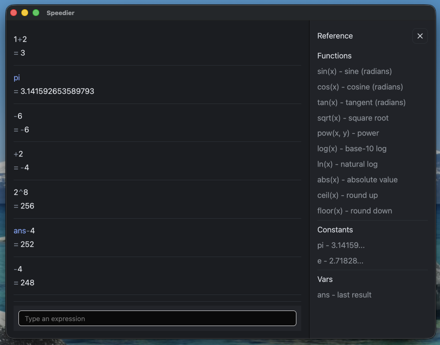

# Speedier

Speedier is a native macOS calculator written in Rust (GPUI), inspired by [SpeedCrunch](https://heldercorreia.bitbucket.io/speedcrunch/). The initial version focuses on a clean keyboard-first workflow with an expression line, live results, and a scrollable history.



## Project layout
- `src/main.rs` – application entry point.
- `src/app.rs` – window construction and interaction wiring.
- `src/calc/` – expression evaluation helpers and history store.

## Getting started
1) Ensure Rust is installed (`rustc --version`).
2) Install dependencies and verify everything compiles:
   ```bash
   cargo run
   ```
   A window titled “Speedier” should open with an input field and history list.

## Expression syntax
- Operators: `+`, `-`, `*`, `/`, `%`, `^` (exponent, right-associative), `!` (factorial for non-negative integers).
- Leading operators (`+`, `-`, `*`, `/`, `%`, `^`) imply `ans` (e.g. `-2` becomes `ans-2`). Use parentheses for negatives: `(-3)`.
- Functions: `sin`, `cos`, `tan`, `sqrt`, `pow`, `log`, `ln`, `abs`, `ceil`, `floor`.
- Constants: `pi`, `e`, `ans`.
- Examples: `5!`, `2^3!`, `pow(2, 3)`, `ans-5`, `(-3)^2`, `1.2e-3`.

## Install on macOS
The script below packages a native `.app` bundle and installs it into `/Applications`, replacing any existing install. This makes it discoverable by Spotlight/Alfred.

```bash
./scripts/install-macos.sh
```

Or with Make:
```bash
make install
```

Notes:
- To install somewhere else: `INSTALL_DIR=~/Applications ./scripts/install-macos.sh`
- To use a different app identifier: `APP_ID=com.yourname.speedier ./scripts/install-macos.sh`
- The script will use `sudo` automatically when installing into `/Applications`. To force behavior: `SUDO=1` or `SUDO=0`.
- Packaging uses `cargo-bundle`; install once with `cargo install cargo-bundle`.

## Roadmap
- Improve numerical precision beyond float64 to match SpeedCrunch’s arbitrary precision.
- Add user‑defined variables, functions, and session persistence.
- Theme polish and macOS menu‑bar shortcuts (⌘N, ⌘S, etc.).
- Packaging to a signed `.app` bundle (cargo-bundle workflow).

## License
MIT.
